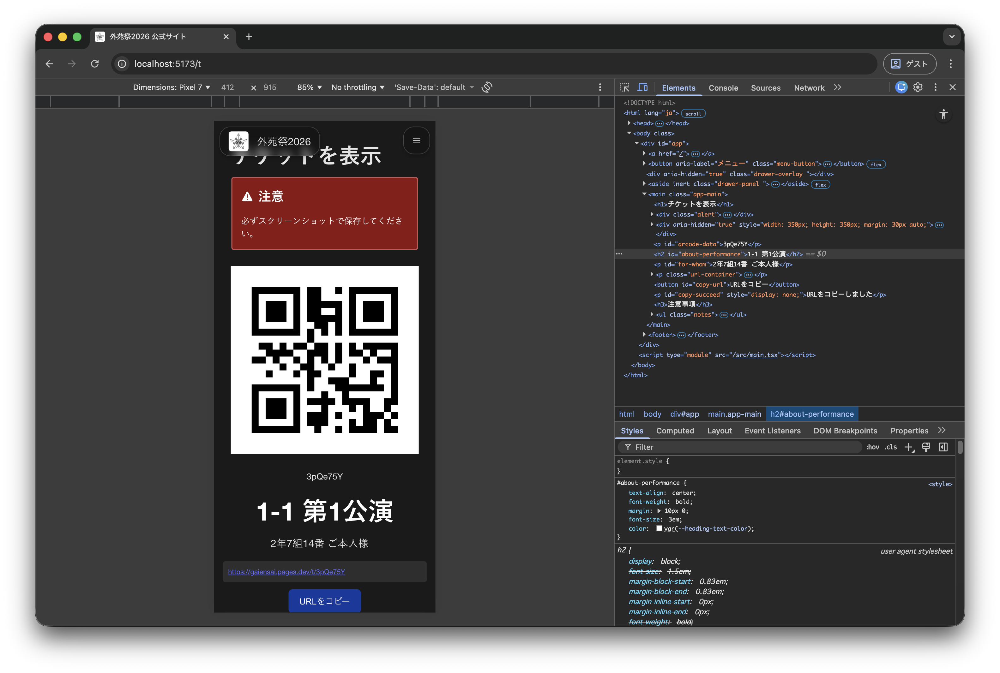
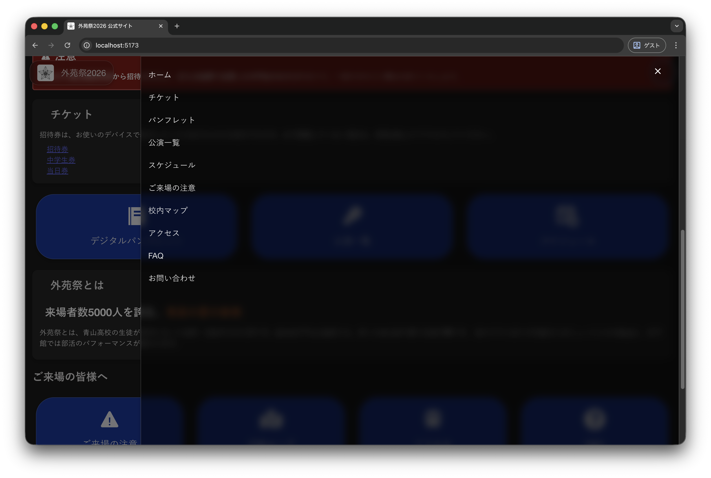
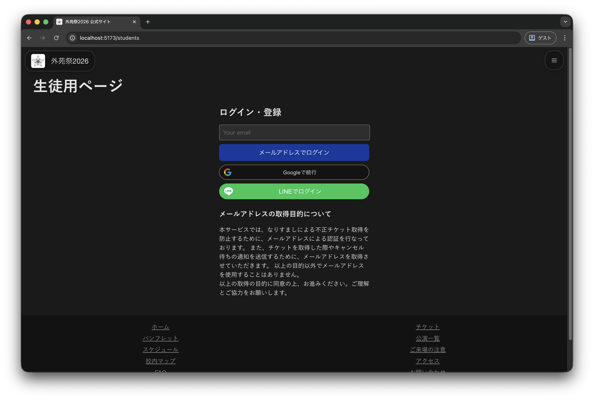

# 実装予定の機能

ここに機能だけを抽出してまとめておいたので、設計書ではわからなかった人も、改めてこの機能で大丈夫か確認してください。特に、「これはいらない」という機能を指摘してくださると助かります。

## 検討してほしい箇所

特にこの機能について、必要かどうか決めてほしいです。詳細はこの下の、機能詳細を確認してください。

- QRコードをまとめる機能
- 生徒のログインを必要にするか、必要ならその方法はこれで十分か
- 青高生ならどのクラスの公演もチケットを発行できるようにするか、あるいは自分で使う予定の公演だけどこでも取れるようにするか。
- 中学生券・当日券の対応
- ネットが落ちて、どうしようもなくなった時、どうするか
- ドメインをどうするか

## 現在発生中のトラブル

[https://gaiensai.pages.dev/](https://gaiensai.pages.dev/)は**校内Wi-Fiでなぜかブロック**される。原因は不明。Cloudflare Pagesでホスティングした他のサイトも表示できなかった。

ドメインを変更すれば解決するかは調査中。ドメインを変更するにせよ、このURLをホワイトリストに入れてもらうにせよ、先生の協力が必要。

## 共通

### QRコードの表示



- チケットを表示
- キャンセル
- 時間帯の変更
- _QRコードをまとめる機能_

万が一すべてのインターネットが落ちたとしても、このページにどの公演か、誰からの招待かが書いてあるので、スクショさえあれば紙のチケットと同じ運用も可能。

#### QRコードをまとめる機能について

紙の招待券だったとき、グループで来場される方は基本的に、グループの**代表者がまとめて**招待券を見せていた。しかし、このシステムでは一枚一枚スキャンする必要があり、それによってかえって時間がかかってしまうのではないかと思った。そのため、複数のQRコードを一つのQRコードにまとめて表示できる機能があったらいいなーと思っている。

しかし、グループで誰かが欠けているなど、**トラブルの原因**になるので、皆さんの意見を聞きたい。

##### 案一覧

- QRコードを1つにまとめてしまう。(グループ解除そのものはボタン1つで可能だが、一度間違って読み取ってしまうと、スキャン履歴を消すのは大変)
- スワイプで簡単に切り替えられるようにするだけ。
- スキャンしたら、読み取り端末側で人数を入力できる。ただし、すべてのスキャンで入力する必要がある。
- 特に何も対策をしない。

### 公演情報の確認



[https://gaiensai.pages.dev](https://gaiensai.pages.dev)に用意しているボタン・URLの内容を表示する。優先度は低。

**公演一覧で画像を使う**と、更新が難しくなるので注意。

## 生徒側

### QRコードの発券

#### ログイン



このように、メールアドレス・Google・LINEのいずれかでアカウント登録をしてもらって、自分の学年・クラス・番号とメールアドレスを紐付ける。すると、**他人になりすまして**発行することが困難になる。

なお、メールアドレスでログインする場合は、**ログイン用URLがメールで送信**され、そのリンクをクリックすることでログインできる仕組みにする予定。(Magic Linkというらしい。)

##### ログインの問題点

- メールアドレスを持っていることが必須
- 特にメールアドレスを使う方式は面倒。
- メールアドレスを忘れてしまう可能性。
- 最初に自分の学年・クラス・番号と紐づけるとき、一度間違えると取り消すのは厄介。
- プライバシーの問題。

##### 代替案

- 全員のID、パスワードを一括で発行し、紙で配布

本当にこれでいいか検討してほしい。

#### 発券

公演に空きがあれば発券する。これをスクショするか、urlを使って共有する。自分が発行したチケットは、それが誰用であってもキャンセル・時間変更ができる。

現在のところは、自クラスの他に、**どのクラスでも予約可能にする予定**

QRコードの生成の仕組みは手書きの簡易設計書参照。

### 公演の空き情報の確認

チケットの残り枚数を確認できる機能。キャンセル等で常に変動する。必須。

## 外部の人

### 中学生券

いつも中学生用に各クラス10人枠をとっているが、これが埋まらず、招待券は完売なのに空席がある悲しい公演を見かける。そのため、中学生も**公演開始10分前まで予約可能にして、残った席を当日券として開放する**(もちろん中学生が当日券で入ることもできる。)ことを考えた。

#### デメリット

- この複雑な仕組みを中学生に説明しなくてはならない。
- サーバーの負荷が大きくなる。
- このプログラムを作るのは結構労力がいる。

### 当日券

今年の、空いている公演にチケットなしで入れるという運用もいいと思うが、生徒は各自の発券ページにて、外部の人は校内に掲載するQRコードで公演を予約できるようにすれば、確実に公演を見れるようになると思う。この機能はそんなに手間はかからない。

#### この方法のデメリット

- 特に外部の人にとっては、このシステムの存在感が薄くなる。
- 最後まで空席の数が変わるので、予約なしで入りにくくなる。

ちなみに、予約なしで入る場合は、**自分が持っているどのQRコードをかざしても入れるようにする**か、あるいは**素通りにする(数を数えるだけ)か**は決めてほしい。どの公演にも使える当日券専用のQRコードを作ることもできるが、ユーザーとって煩雑になるだけなのでおすすめはしない。

## 読み取り端末

- スキャン
- うまく読み取れない時は手入力可能
- 複数回使用検出
- 正規のQRコードか判定
- スキャン履歴をブラウザ内に保存
- 事前にインストールすれば、オフラインでも運用可能
- 履歴画面では、履歴の編集・削除ができる
- Excel用に出力可能

### 注意

オフラインで実装すると、**複数端末の間で読み取り履歴を共有できない**ので、**同じQRコードを端末を変えてスキャンすると、複数回使用が検知できない**。また、**QRコードがキャンセルされたどうか判別不能**。

オンラインのうちは同期させ、接続が不安定になったらオフラインが理想だが、できるかどうかはわからない。多分できるけど。

また、事前にインストールする機能はPWAというものを使う予定だが、**iOSだとPWA対応が不完全**で、うまく動作しない可能性がある。

### 認証

各クラスの入場に使う用の読み取り端末は、ページのURLに推測不能な文字列を入れて、**URLを知らないと開けない**程度のセキュリティ対策は用意する予定。

## 設定

主に来年も引き続き使えるようにするために、変更する可能性がある箇所を設定ページとして作る。例えば、

- 公演情報を変更
- 学年クラス番号の変更
- すべてのチケットを削除
- すべてのアカウントを削除
- すべての読み取り履歴を削除

のような機能を用意する予定。優先度は低。

また、Webページの内容を更新するのには`YAML`という形式のファイルを用いる予定。

```config.yaml
year: 2026
date:
  -8/30
  -8/31
・・・
```

というように、比較的書きやすいファイルなので、なんとか来年以降の総務にも書いていただいて、それをCloudflare Pagesにアップロードしてほしいなあ、という僕の願望です。

また、ページ内の画像ファイルは、名前を変えずにそのまま置き換えて、アップロードするだけで更新できる。

ちなみに、Supabaseなら元々アプリがついていて、あらゆるものをいじることもできるので、最悪設定画面を作らなくても更新はできると思う。ただし、これは何をしたら良いかわからないし、余計なところをいじって壊してしまう可能性が高い。

## 最後に

来年度引き継ぎ用のマニュアル書くのは大変なので、誰か書いてくれませんか。また、将来このコードをメンテナンスする人のために本来は仕様書(細かい動きまで詳細に決めた書類)を残すべきだけど、僕にそんな余裕がないので、書いてくれる人がいたら本当にうれしいです。ちなみに仕様書の書き方は知りません。
